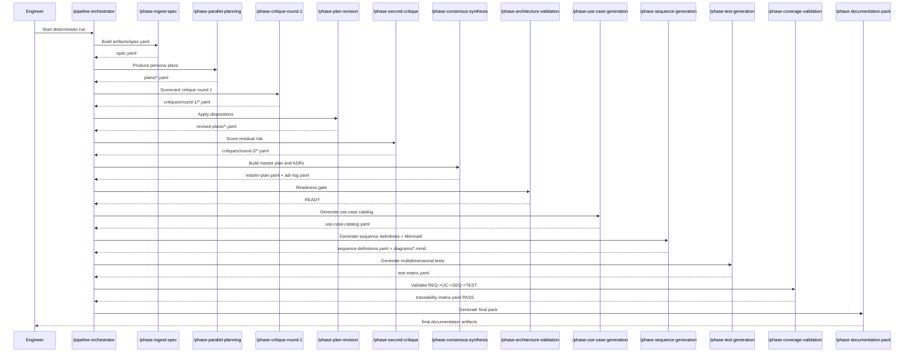
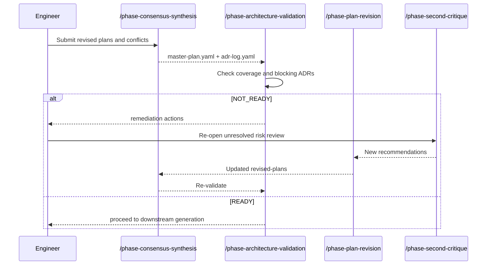
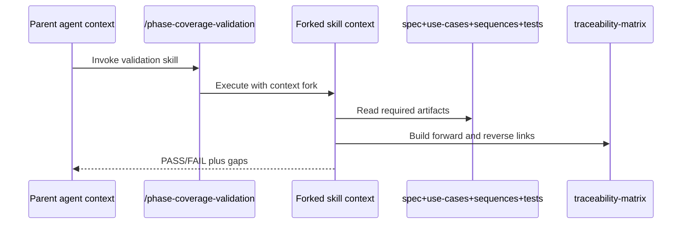

# Long-Read System Documentation

## Executive summary
This repository implements a deterministic, skills-first multi-agent architecture pipeline template for GitHub Copilot and VS Code. It is designed to drive architecture planning, critique, convergence, validation, and artifact generation through strict phase gates and schema-bound outputs. Evidence: README.md:3, README.md:5, README.md:46, README.md:66, .github/agents/AGENTS.md:15, .github/agents/AGENTS.md:46

The system is organized around three control layers: orchestration and role registry, reusable skills and prompts, and YAML artifact contracts. Evidence: .github/agents/AGENTS.md:5, docs/skills-catalog.md:10, templates/artifacts/spec.yaml:1

The design goal is predictable execution with explicit fail-fast behavior, complete traceability across artifacts, and no open-ended debate loops. Evidence: .github/agents/AGENTS.md:11, .github/agents/AGENTS.md:12, .github/agents/AGENTS.md:162, docs/pipeline-runbook.md:43

## System purpose, scope, and non-goals
### Purpose
Provide reusable repository components so new projects can execute a deterministic multi-agent architecture workflow from raw spec to final documentation pack. Evidence: README.md:3, README.md:87, docs/pipeline-runbook.md:3

### Scope
- Deterministic phase registry and contracts. Evidence: .github/agents/AGENTS.md:15, .github/agents/AGENTS.md:46
- Persona-based planning and critique agents. Evidence: .github/agents/AGENTS.md:179, .github/agents/AGENTS.md:187
- Skill command surface and prompt compatibility. Evidence: README.md:46, README.md:108, docs/skills-catalog.md:53
- Canonical YAML schemas for phase artifacts. Evidence: README.md:66, .github/instructions/schema-standards.instructions.md:9

### Non-goals
- It is not an external orchestration service with a separate runtime daemon. Evidence: README.md:120
- It does not permit unbounded, open-ended debate rounds. Evidence: .github/agents/AGENTS.md:11, .github/instructions/pipeline-core.instructions.md:16
- It does not define a concrete product API surface for a business application in this repository. Evidence: templates/artifacts/documentation-pack.yaml:7, docs/skills-catalog.md:10

## Architecture overview
### Boundaries
- Orchestration boundary: phase ordering, role registry, and hard constraints in AGENTS. Evidence: .github/agents/AGENTS.md:5, .github/agents/AGENTS.md:15, .github/agents/AGENTS.md:177, .github/agents/AGENTS.md:198
- Interaction boundary: skills and prompts as operator entry points. Evidence: docs/skills-catalog.md:53, docs/skills-catalog.md:10
- Contract boundary: YAML templates for each phase output. Evidence: templates/artifacts/spec.yaml:1, templates/artifacts/plan.yaml:1, templates/artifacts/traceability-matrix.yaml:1
- Governance boundary: instruction files enforce behavior and schema rules. Evidence: .github/instructions/pipeline-core.instructions.md:11, .github/instructions/schema-standards.instructions.md:6

### Components
- Phase registry and mapping: AGENTS phase list plus slash-command mapping. Evidence: .github/agents/AGENTS.md:15, .github/agents/AGENTS.md:30
- Skills: one orchestration skill plus phase skills. Evidence: docs/skills-catalog.md:5, docs/skills-catalog.md:10
- Prompts: phase procedures with hard-fail conditions. Evidence: .github/prompts/phase-00-ingest-spec.prompt.md:22, .github/prompts/phase-06-consensus-synthesis.prompt.md:25, .github/prompts/phase-11-coverage-validation.prompt.md:25
- Templates: typed artifact skeletons for all phases. Evidence: README.md:67, templates/artifacts/documentation-pack.yaml:7

### Dependencies
- Skills depend on prompts and templates. Evidence: docs/skills-catalog.md:11, docs/skills-catalog.md:12, docs/skills-catalog.md:13
- Prompts depend on upstream artifacts from previous phases. Evidence: .github/prompts/phase-08-use-case-generation.prompt.md:10, .github/prompts/phase-09-sequence-generation.prompt.md:10, .github/prompts/phase-10-test-scenario-generation.prompt.md:10
- Validation phases depend on full upstream chain. Evidence: .github/prompts/phase-11-coverage-validation.prompt.md:10, .github/skills/phase-coverage-validation/SKILL.md:12

### Data flow
1. Spec ingestion creates artifacts/spec.yaml. Evidence: .github/agents/AGENTS.md:48, .github/prompts/phase-00-ingest-spec.prompt.md:13
2. Parallel planning produces per-persona plans. Evidence: .github/agents/AGENTS.md:56, .github/agents/AGENTS.md:60
3. Critique and revision loops refine plans and capture conflicts. Evidence: .github/agents/AGENTS.md:69, .github/agents/AGENTS.md:77, .github/agents/AGENTS.md:86
4. Consensus produces master plan and ADR log. Evidence: .github/agents/AGENTS.md:103, .github/agents/AGENTS.md:109
5. Architecture validation gates downstream generation. Evidence: .github/agents/AGENTS.md:114, .github/agents/AGENTS.md:122
6. Use cases, sequences, tests, and traceability are generated and validated. Evidence: .github/agents/AGENTS.md:124, .github/agents/AGENTS.md:133, .github/agents/AGENTS.md:143, .github/agents/AGENTS.md:153
7. Documentation pack links all artifacts. Evidence: .github/agents/AGENTS.md:164, templates/artifacts/documentation-pack.yaml:7

## Component reference
### Phase registry
Responsibilities: canonical ordering, contract enforcement, role inventory, hard constraints. Evidence: .github/agents/AGENTS.md:15, .github/agents/AGENTS.md:46, .github/agents/AGENTS.md:177, .github/agents/AGENTS.md:198
Inputs: repository policy and phase definitions. Evidence: .github/agents/AGENTS.md:5
Outputs: enforceable pipeline contract. Evidence: .github/agents/AGENTS.md:46
Failure modes: skipped phase, invented artifacts, progression after gate failure, unresolved contradictions without ADR. Evidence: .github/agents/AGENTS.md:199, .github/agents/AGENTS.md:200, .github/agents/AGENTS.md:201, .github/agents/AGENTS.md:202

### Skills layer
Responsibilities: operator entrypoints for deterministic phase execution. Evidence: README.md:46, docs/skills-catalog.md:53
Inputs: slash command invocation and required phase artifacts. Evidence: .github/skills/pipeline-orchestrator/SKILL.md:4, .github/skills/phase-test-generation/SKILL.md:11
Outputs: phase-specific artifact updates and gate outcome. Evidence: .github/skills/phase-architecture-validation/SKILL.md:17, .github/skills/phase-coverage-validation/SKILL.md:18
Failure modes: gate fail on missing links or unresolved blockers. Evidence: .github/skills/phase-architecture-validation/SKILL.md:27, .github/skills/phase-coverage-validation/SKILL.md:27

### Prompt procedures
Responsibilities: detailed procedural execution for each phase. Evidence: docs/skills-catalog.md:11, docs/skills-catalog.md:50
Inputs: upstream artifacts as declared per phase. Evidence: .github/prompts/phase-09-sequence-generation.prompt.md:10, .github/prompts/phase-10-test-scenario-generation.prompt.md:10
Outputs: schema-conformant YAML artifacts and Mermaid files where applicable. Evidence: .github/prompts/phase-09-sequence-generation.prompt.md:15, .github/prompts/phase-10-test-scenario-generation.prompt.md:16
Failure modes: explicit hard-fail conditions per prompt. Evidence: .github/prompts/phase-00-ingest-spec.prompt.md:22, .github/prompts/phase-10-test-scenario-generation.prompt.md:33, .github/prompts/phase-11-coverage-validation.prompt.md:25

### Artifact contracts
Responsibilities: stable data model across phases, ID continuity, and traceability. Evidence: .github/instructions/schema-standards.instructions.md:27, .github/instructions/schema-standards.instructions.md:29, .github/instructions/schema-standards.instructions.md:38
Inputs: generated phase outputs.
Outputs: canonical YAML documents with schema metadata. Evidence: .github/instructions/schema-standards.instructions.md:21, templates/artifacts/spec.yaml:1
Failure modes: missing required keys, invalid references, broken chain mapping. Evidence: .github/instructions/schema-standards.instructions.md:30, .github/instructions/schema-standards.instructions.md:42

## Runtime behavior
### Startup
- Bootstrap requires creating artifacts folder structure and placing raw spec in spec/raw-spec.md. Evidence: docs/pipeline-runbook.md:5, docs/pipeline-runbook.md:19
- Operator then invokes either full orchestration or phase skills. Evidence: docs/pipeline-runbook.md:22, docs/pipeline-runbook.md:37

### Request lifecycle
- Lifecycle is phase-driven and file-mediated, not request-response service traffic.
- A typical run is /pipeline-orchestrator, which dispatches ordered phase commands. Evidence: .github/skills/pipeline-orchestrator/SKILL.md:19
- Each phase reads explicit inputs and writes explicit outputs, then gate-checks before continuation. Evidence: .github/agents/AGENTS.md:46, .github/agents/AGENTS.md:54

### Background jobs and async behavior
- Two skills are configured with context fork, indicating isolated subagent execution behavior for validation workloads. Evidence: .github/skills/phase-architecture-validation/SKILL.md:7, .github/skills/phase-coverage-validation/SKILL.md:7
- No additional queue or scheduler implementation is defined in repository files. Evidence: docs/pipeline-runbook.md:22, templates/artifacts/documentation-pack.yaml:7

### Integrations
- Intra-repo integration is through file contracts and phase dependencies.
- No external integration connector files are defined in this repository template. Evidence: .github/prompts/phase-08-use-case-generation.prompt.md:10, .github/prompts/phase-11-coverage-validation.prompt.md:10

## APIs and contracts
### Interfaces
- Primary interface is slash-command skills exposed in chat. Evidence: docs/skills-catalog.md:53, docs/skills-catalog.md:55
- Secondary interface is prompt files used as compatibility wrappers. Evidence: docs/pipeline-runbook.md:40

### Payloads
- Spec payload includes actors, requirements, constraints, non_goals, acceptance_criteria, and open_questions. Evidence: templates/artifacts/spec.yaml:7, templates/artifacts/spec.yaml:11, templates/artifacts/spec.yaml:18, templates/artifacts/spec.yaml:22, templates/artifacts/spec.yaml:24, templates/artifacts/spec.yaml:30
- Plan payload includes requirement IDs, decisions, components, data model, risks, assumptions, complexity, confidence. Evidence: templates/artifacts/plan.yaml:6, templates/artifacts/plan.yaml:8, templates/artifacts/plan.yaml:16, templates/artifacts/plan.yaml:22, templates/artifacts/plan.yaml:30, templates/artifacts/plan.yaml:36, templates/artifacts/plan.yaml:40, templates/artifacts/plan.yaml:41
- Coverage payload includes forward and reverse trace plus gaps and overall status. Evidence: templates/artifacts/traceability-matrix.yaml:4, templates/artifacts/traceability-matrix.yaml:13, templates/artifacts/traceability-matrix.yaml:21, templates/artifacts/traceability-matrix.yaml:27

### Auth and permissioning
- No HTTP auth scheme or token model is defined in this repository template.
- Operational permissions are effectively command-driven with manual invocation and explicit fail policies. Evidence: .github/skills/pipeline-orchestrator/SKILL.md:5, .github/skills/pipeline-orchestrator/SKILL.md:6, .github/skills/pipeline-orchestrator/SKILL.md:35

### Versioning
- Artifact-level versioning uses schema_version in templates. Evidence: templates/artifacts/spec.yaml:1, templates/artifacts/plan.yaml:1, templates/artifacts/documentation-pack.yaml:1

## Data model and persistence
### Core entities
- Requirement, use case, sequence, and test IDs are first-class and must remain linked. Evidence: .github/instructions/schema-standards.instructions.md:13, .github/instructions/schema-standards.instructions.md:38
- Decision records are captured in ADR structures with accepted, rejected, unresolved fields. Evidence: templates/artifacts/adr-log.yaml:19, templates/artifacts/adr-log.yaml:20, templates/artifacts/adr-log.yaml:23

### Persistence model
- Persistence is file-based under artifacts paths declared by phase contracts. Evidence: .github/agents/AGENTS.md:52, .github/agents/AGENTS.md:129, .github/agents/AGENTS.md:149, .github/agents/AGENTS.md:160
- Final documentation pack indexes all major generated artifacts by path. Evidence: templates/artifacts/documentation-pack.yaml:7

### Data integrity
- IDs must not be renamed between phases and references must resolve upstream. Evidence: .github/instructions/schema-standards.instructions.md:29, .github/instructions/schema-standards.instructions.md:30

## Configuration and environment behavior
### Behavioral configuration
- Global behavioral policy is in copilot-instructions plus pipeline instructions. Evidence: copilot-instructions.md:6, copilot-instructions.md:50, .github/instructions/pipeline-core.instructions.md:11
- Schema and ID convention policy is centralized in schema standards instruction. Evidence: .github/instructions/schema-standards.instructions.md:13, .github/instructions/schema-standards.instructions.md:27

### Execution configuration
- Skills are configured as deterministic manual invocations through disable-model-invocation true. Evidence: README.md:48, .github/skills/pipeline-orchestrator/SKILL.md:6
- Select validation skills are configured for forked context. Evidence: .github/skills/phase-architecture-validation/SKILL.md:7, .github/skills/phase-coverage-validation/SKILL.md:7

### Environment variables
- Generic test commands mention TEST_BASE_URL usage in top-level instructions, but no dedicated environment manifest exists for this template. Evidence: copilot-instructions.md:30

## Security and permission model
### Defined security policies
- Secret hygiene policy: never write raw secrets into source, docs, logs, commits. Evidence: copilot-instructions.md:42, copilot-instructions.md:43
- Use environment variables and secret stores for sensitive values. Evidence: copilot-instructions.md:44

### Control model
- Gate-based control: progression halts on schema or traceability failures and unresolved blockers. Evidence: .github/instructions/pipeline-core.instructions.md:15, .github/instructions/pipeline-core.instructions.md:44, docs/pipeline-runbook.md:43
- Manual command control through skills and strict phase ordering. Evidence: docs/skills-catalog.md:53, .github/agents/AGENTS.md:30

### Unknowns
- No app-level RBAC, authz policy, cryptographic signing, or network policy files are defined in this repository template.

## Reliability and observability
### Reliability behavior
- Fail-fast behavior is explicit at both instruction and runbook levels. Evidence: .github/instructions/pipeline-core.instructions.md:15, docs/pipeline-runbook.md:43
- Iteration limits reduce runaway loops. Evidence: .github/instructions/pipeline-core.instructions.md:20
- Coverage validation enforces end-to-end chain integrity. Evidence: .github/prompts/phase-11-coverage-validation.prompt.md:20, .github/prompts/phase-11-coverage-validation.prompt.md:25

### Error handling and compensation
- Architecture validation returns READY or NOT_READY with remediation, enabling corrective re-entry into upstream phases. Evidence: .github/skills/phase-architecture-validation/SKILL.md:24
- Conflict and revision artifacts preserve change rationale for iterative correction. Evidence: templates/artifacts/conflict-report.yaml:11, templates/artifacts/revised-plan.yaml:7

### Logging, metrics, tracing, alerts
- No explicit runtime logging, metric, tracing, or alert configuration artifacts are defined.
- Observability is currently artifact-based through validation and traceability outputs. Evidence: templates/artifacts/validation-report.yaml:5, templates/artifacts/traceability-matrix.yaml:21

## Build, deploy, and operations notes
### Build and deploy
- No build manifest or deploy pipeline files are defined for an executable service in this template repository.

### Operations
- Standard operational flow is bootstrap, execute ordered skills, and respect strict fail gates. Evidence: docs/pipeline-runbook.md:5, docs/pipeline-runbook.md:22, docs/pipeline-runbook.md:43
- Commit workflow guidance exists in copilot instructions. Evidence: copilot-instructions.md:38, copilot-instructions.md:40

### Documentation operations
- Final pack includes version and artifact index for operational handoff. Evidence: templates/artifacts/documentation-pack.yaml:5, templates/artifacts/documentation-pack.yaml:7

## Testing strategy and current coverage gaps
### Strategy
- Test generation requires unit, integration, contract, e2e, chaos, performance, security, concurrency, recovery, migration. Evidence: .github/prompts/phase-10-test-scenario-generation.prompt.md:19, templates/artifacts/test-matrix.yaml:4
- Tests must be linked to REQ, UC, and SEQ IDs. Evidence: .github/prompts/phase-10-test-scenario-generation.prompt.md:30, templates/artifacts/test-matrix.yaml:19
- Coverage validation enforces both forward and reverse trace mapping. Evidence: .github/prompts/phase-11-coverage-validation.prompt.md:20, .github/prompts/phase-11-coverage-validation.prompt.md:21

### Current gaps
- Repository currently provides templates and procedures; it does not contain concrete executed test suites or coverage reports for a running application.
- Many template values are placeholders and require project-specific population before operational confidence claims can be made. Evidence: templates/artifacts/test-matrix.yaml:17, templates/artifacts/use-case-catalog.yaml:6, templates/artifacts/spec.yaml:5

## Risks, assumptions, and open questions
### Risks
- Process compliance risk: without an external runner, enforcement relies on operator and agent adherence to skill and prompt contracts. Evidence: README.md:120, .github/instructions/pipeline-core.instructions.md:12
- Schema consistency risk: metadata standard calls for owners or personas; some templates include persona while others do not include owners field explicitly. Evidence: .github/instructions/schema-standards.instructions.md:21, templates/artifacts/spec.yaml:1, templates/artifacts/plan.yaml:5
- Drift risk: if any chain link is skipped, final artifact coherence degrades. Evidence: .github/agents/AGENTS.md:162, docs/pipeline-runbook.md:63

### Assumptions
- Artifact paths and naming conventions remain stable across projects using this template. Evidence: .github/agents/AGENTS.md:52, templates/artifacts/documentation-pack.yaml:9
- Skills are discoverable and invokable in the target VS Code environment. Evidence: README.md:91, docs/skills-catalog.md:54

### Open questions
- Should this template add a deterministic external validator or CI gate runner.
- Should model-vendor pinning be added to planning agent routing.
- Should Mermaid rendering be automated beyond .mmd output contracts.

## Glossary
- AGENTS registry: source of truth for phase order, contracts, and hard constraints. Evidence: .github/agents/AGENTS.md:5
- Skill: reusable slash-command capability represented by SKILL.md. Evidence: docs/skills-catalog.md:53
- Prompt: phase procedure document used by skills and compatibility workflows. Evidence: docs/skills-catalog.md:12
- Artifact contract: YAML schema template for phase output. Evidence: README.md:66
- ADR log: consensus decision record with accepted, rejected, unresolved entries. Evidence: templates/artifacts/adr-log.yaml:19
- Traceability matrix: mapping between requirements, use cases, sequences, and tests. Evidence: templates/artifacts/traceability-matrix.yaml:4
- READY status: architecture-validation gate pass condition for downstream phases. Evidence: .github/agents/AGENTS.md:122, templates/artifacts/validation-report.yaml:4

## Sequence diagrams
### Typical happy-path user journey

Evidence: .github/skills/pipeline-orchestrator/SKILL.md:19, .github/prompts/phase-09-sequence-generation.prompt.md:15, .github/prompts/phase-11-coverage-validation.prompt.md:20

### Common failure path with retry or compensation behavior

Evidence: .github/prompts/phase-06-consensus-synthesis.prompt.md:25, .github/skills/phase-architecture-validation/SKILL.md:24, .github/skills/phase-architecture-validation/SKILL.md:27

### Async or background flow

Evidence: .github/skills/phase-coverage-validation/SKILL.md:7, .github/skills/phase-coverage-validation/SKILL.md:12, .github/skills/phase-coverage-validation/SKILL.md:23

## Completeness matrix
| Area | Status | Evidence citations | What is still unknown |
|---|---|---|---|
| Executive summary | complete | README.md:3; .github/agents/AGENTS.md:15 | none |
| System purpose, scope, non-goals | complete | README.md:3; README.md:120; .github/agents/AGENTS.md:11 | none |
| Architecture overview | complete | .github/agents/AGENTS.md:15; .github/agents/AGENTS.md:46; docs/skills-catalog.md:10 | none |
| Component reference | complete | .github/agents/AGENTS.md:177; .github/prompts/phase-06-consensus-synthesis.prompt.md:15 | none |
| Runtime behavior | partial | docs/pipeline-runbook.md:5; docs/pipeline-runbook.md:22; .github/skills/phase-architecture-validation/SKILL.md:7 | no executable service runtime or scheduler artifacts |
| APIs and contracts | partial | docs/skills-catalog.md:53; templates/artifacts/spec.yaml:1; templates/artifacts/traceability-matrix.yaml:1 | no HTTP/RPC API definitions or auth protocol |
| Data model and persistence | partial | templates/artifacts/spec.yaml:11; templates/artifacts/adr-log.yaml:4; templates/artifacts/documentation-pack.yaml:7 | no database schema or migration scripts |
| Configuration and environment behavior | partial | .github/instructions/pipeline-core.instructions.md:11; .github/instructions/schema-standards.instructions.md:13; copilot-instructions.md:30 | no dedicated environment manifest for deploy targets |
| Security and permission model | partial | copilot-instructions.md:42; .github/instructions/pipeline-core.instructions.md:44 | no app RBAC/authz artifacts |
| Reliability and observability | partial | .github/instructions/pipeline-core.instructions.md:15; .github/prompts/phase-11-coverage-validation.prompt.md:25; templates/artifacts/validation-report.yaml:11 | no metrics/tracing/alert definitions |
| Build, deploy, operations notes | partial | docs/pipeline-runbook.md:5; copilot-instructions.md:38 | no CI/CD pipeline or deploy manifests in repo |
| Testing strategy and current coverage gaps | partial | .github/prompts/phase-10-test-scenario-generation.prompt.md:19; templates/artifacts/test-matrix.yaml:4 | no concrete executed tests or coverage report |
| Risks, assumptions, open questions | complete | .github/instructions/schema-standards.instructions.md:21; .github/agents/AGENTS.md:162 | none |
| Glossary | complete | docs/skills-catalog.md:53; templates/artifacts/traceability-matrix.yaml:4 | none |

## Quality gate check
- No major subsystem undocumented: pass for all repository-defined subsystems.
- All critical flows have at least one sequence diagram: pass.
- Major claims are evidence-backed: pass.
- Unknowns are explicitly labeled and not guessed: pass.

Evidence: README.md:12, docs/skills-catalog.md:10, .github/agents/AGENTS.md:46

## Exact questions to close documentation gaps
1. Should this template remain instruction-and-contract based, or should we add an executable validator CLI and CI workflow that enforces phase gates outside chat behavior?
2. Should planner routing remain persona-only, or should we encode explicit model-vendor mapping in phase contracts?
3. Should sequence generation include an automated Mermaid render pipeline that outputs images alongside .mmd files?
4. Should we define an explicit artifact approval workflow for security and governance, including who can accept unresolved tradeoffs?
5. Should we add mandatory observability outputs (for example artifact audit log, phase timing metrics, and alert thresholds) to this template?
